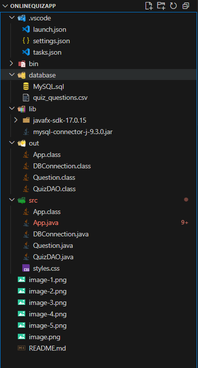
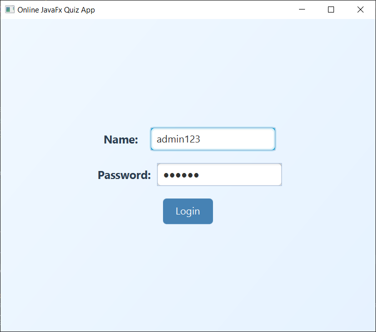

# 🧠 Online Quiz Application - JavaFX + MySQL

A desktop quiz application built using JavaFX, MySQL, and JDBC. Users can log in, take a quiz based on multiple-choice questions, and view their results.

---

## 📁 Project Structure



The workspace contains two folders by default, where:

- `src`: the folder to maintain sources
- `lib`: the folder to maintain dependencies

Meanwhile, the compiled output files will be generated in the `bin` folder by default.

---

## 🔧 Prerequisites

- Java JDK 17+
- JavaFX SDK 17+
- MySQL Server 8.0+
- MySQL Connector/J (JDBC driver)

---

## ⚙️ MySQL Setup

### 1. Start MySQL:

```bash
mysql -u root -p

```

### 2. Create and Use the Database
```sql
CREATE DATABASE IF NOT EXISTS java_quizdb;
USE java_quizdb;

```
### 3. Create Table

```sql
CREATE TABLE IF NOT EXISTS questions (
    id INT PRIMARY KEY AUTO_INCREMENT,
    category VARCHAR(100),
    question_text TEXT NOT NULL,
    option_a VARCHAR(255),
    option_b VARCHAR(255),
    option_c VARCHAR(255),
    option_d VARCHAR(255),
    correct_option VARCHAR(255)
);

```

### 4. Import CSV into Table

```sql
Move quiz_questions.csv to:
'C:/ProgramData/MySQL/MySQL Server 8.0/Uploads/'
```

---

## 🖥️ Compilation & Execution

### 1. Compile

```java
javac --module-path "lib/javafx-sdk-17.0.15/lib" --add-modules javafx.controls,javafx.fxml -d out src/*.java

```

### 2. Run the App

```java
java --module-path "lib/javafx-sdk-17.0.15/lib" --add-modules javafx.controls,javafx.fxml -cp out App

```
---
## Outputs

### Welcome Page


### User Login with admin123


### Start Quiz


### Random 5 Questions


### Score and Re-start

