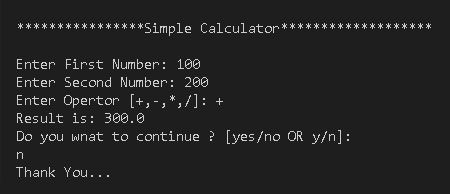

# 🔢 Simple Calculator – Java Console App

This is a basic **Java console-based calculator** developed during my internship at **Elevate Labs**.
 It performs fundamental arithmetic operations like addition, subtraction, multiplication, and division using `int` values.

---

## 🎯 Features

- Accepts user input for two numbers and an operator
- Supports `+`, `-`, `*`, `/` operations
- Handles divide-by-zero using exception handling
- Repeats calculations until the user chooses to exit
- Input validation and clean console interaction

---

## 🛠️ Tech Stack

- Language: **Java**
- Input Handling: `Scanner`
- Logic: `if/switch`, method-based operations
- Exception Handling: `try-catch` for divide-by-zero

---

## 🚀 How to Run

